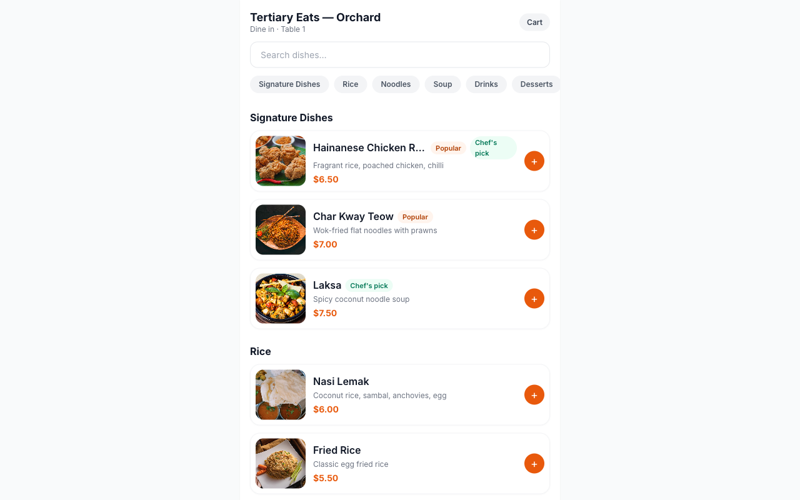

# 🍽️ Food Ordering System

A production-ready, multi-tenant SaaS restaurant ordering platform — QR table ordering, takeaway, real-time order tracking, a management dashboard, and a Kitchen Display System (KDS). Inspired by YQueue-style workflows.



## Tech


## Apps (npm workspaces monorepo)

| App                | Stack                                              | Purpose                                  |
| ------------------ | -------------------------------------------------- | ---------------------------------------- |
| **`api`**          | Express · TypeScript · Prisma · PostgreSQL · Socket.IO · Stripe | Shared REST + realtime backend |
| **`customer-web`** | Next.js · React · Tailwind · Zustand · TanStack Query | Mobile-first customer ordering        |
| **`admin-web`**    | Vite · React · Tailwind · Recharts                 | Admin dashboard + Kitchen Display (KDS)  |
| **`shared`**       | TypeScript · Zod                                   | Shared DTO schemas, types, enums         |

The API is the single source of truth for the web apps and any future iOS / Android / iPad POS client.

## Features

**Customer (`customer-web`)**
- QR table ordering (`/table/:qrToken` auto-opens a dine-in session) + takeaway
- Category tabs, search, item modifiers (size / protein / add-ons), special requests
- Cart with persistence, checkout with tax + service charge + coupons
- **Real Stripe** payments (card / PayNow / GrabPay) + cash; live order tracking via Socket.IO

**Admin (`admin-web`)**
- Dashboard KPIs (revenue, orders, AOV, active/completed) — live
- Order management (queue, filters, search, status flow) + **full-screen KDS**
- CRUD for menu, categories, modifier groups, tables (+ QR generate/download/print/regenerate)
- Multi-brand / multi-outlet management, users & RBAC, coupons, loyalty
- Reports & analytics (sales/products/category charts) with CSV / Excel / PDF export
- **Brand/outlet switcher** scopes every view

**Backend (`api`)**
- JWT auth (access + refresh) · bcrypt · role-based access control (SUPER_ADMIN / MANAGER / STAFF)
- Tenant scoping, Zod validation, Helmet, CORS allowlist, rate limiting, audit logging
- Socket.IO rooms (outlet / session / kitchen) · Stripe webhook · Swagger at `/api/docs`
- Pluggable payment-provider abstraction (Stripe live; HitPay/Xendit ready)

## Quick start

```bash
npm install
cp .env.example .env            # set DATABASE_URL, JWT secrets, Stripe keys
docker compose up -d db         # or point DATABASE_URL at any Postgres
npm run db:push && npm run db:seed

npm run dev:api                 # http://localhost:4000  (docs: /api/docs)
npm run dev:customer            # http://localhost:5173
npm run dev:admin               # http://localhost:5174
```

Demo logins (seeded): `superadmin@foodorder.dev / Admin123!`, `manager@…/Manager123!`, `staff@…/Staff123!`.
The seed prints the main outlet id — put it in `customer-web/.env` as `NEXT_PUBLIC_DEFAULT_RESTAURANT_ID` to enable `/takeaway` without a QR.

## One-command containerised deploy

```bash
docker compose up -d --build    # db + api + customer + admin + nginx on :80
```

- `/` → customer app · `/admin/` → dashboard + KDS · `/api/` → REST + Swagger · `/socket.io/` → realtime

See **[DEPLOYMENT.md](DEPLOYMENT.md)** for env vars, Stripe webhook setup, and production notes.

## Repo layout

```
foodorder/
├── api/            # Express + Prisma + Socket.IO + Stripe
├── customer-web/   # Next.js/React customer ordering app
├── admin-web/      # Vite/React admin + KDS
├── shared/         # Zod schemas + types + enums (consumed by all)
├── nginx/          # reverse proxy
├── docker-compose.yml
├── DEPLOYMENT.md
└── .env.example
```

## Scripts (root)

```bash
npm run typecheck     # typecheck all workspaces
npm run build         # build frontends
npm run db:push       # sync Prisma schema
npm run db:seed       # seed demo data
npm run db:studio     # Prisma Studio
```

## Tech notes

- `@foodorder/shared` is consumed as **TS source** via a Vite/tsx path alias — no build step.
- All money is computed **server-side** from the live menu; clients never set prices.
- Decimals are serialized to numbers and Dates to ISO strings at the API boundary.
